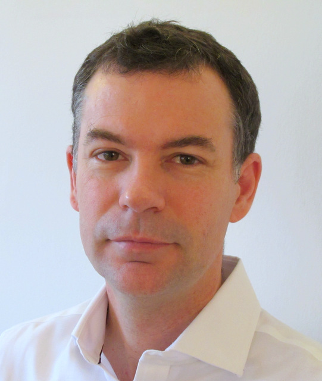

{: width="200"}

Dr Patrick Janssen is Head of Research at [Packhunt](https://packhunt.io) in Amsterdam, The
Netherlands. Packhunt develops a cloud-native parametric platform that automates the workflow from
sales to production for the construction industry.

From 2008 to 2022, Dr Janssen was Associate Professor at the Department of Architecture at the
National University of Singapore, where he founded and directed the [Design Automation
Laboratory](https://design-automation.net).

Dr Janssen researches computational methods and tools for design exploration and optimisation at the
urban scale. Key focus areas are parametric modelling and evolutionary optimisation.

At the Design Automation Lab, he led a team developing a new generation of web-​based methods and
tools that support double-​loop learning, where goals and decision-​making rules are modified in the
light of experience. The lab developed the Mobius ecosystem, a set of open-​source tools for 3D
design modelling and optimisation, leveraging the power of cloud computing. Other areas of research
include Geospatial Modelling (GIS), Building Information Modelling (BIM), Virtual Reality (VR), and
Participatory Design (PD).

## Packhunt

Packhunt is a computational design and technology company based in Amsterdam. Its cloud-native
parametric platform lets manufacturers and suppliers in the
building industry automate the full workflow from sales, through design and engineering, to
production. Voortaan, an initiative built on the Packhunt platform, aims to speed up the Dutch
building supply chain by connecting design, production, and delivery.

Websites:

* [Packhunt](https://www.packhunt.io){:target="blank"}
* [Packhunt for Factories](https://www.packhunt.io/packhunt-for-factories){:target="blank"}
* [Packhunt Blog and News](https://www.packhunt.io/blog){:target="blank"}
* [Packhunt Documentation](https://docs.packhunt.io/){:target="blank"}
* [Voortaan](https://voortaan.nl/){:target="blank"}

LinkedIn:

* [Packhunt on LinkedIn](https://www.linkedin.com/company/packhunt){:target="blank"}
* [Voortaan on LinkedIn](https://www.linkedin.com/company/voortaan){:target="blank"}
* [Patrick Janssen on LinkedIn](https://www.linkedin.com/in/patrickhtjanssen/){:target="blank"}

## Research interests

- Parametric Modelling
- Evolutionary Optimisation
- Geospatial Modelling (GIS)
- Building Information Modelling (BIM)
- Virtual Reality (VR)
- Participatory Design (PD)

## Education

- PhD, Hong Kong Polytechnic University
- MSc, Cognitive Science and Intelligent Computing, Westminster University
- AA Diploma, Architectural Association School of Architecture
- BA(Arch), University of Manchester

## Earlier Work: The Möbius Ecosystem

Between 2015 and 2022, Dr Janssen led the development of The Möbius Ecosystem at the Design
Automation Lab, National University of Singapore.

The Möbius Ecosystem encompasses various open-source tools and libraries for supporting spatial
computational thinking. At the core of this ecosystem is Möbius Modeller, a parametric modelling
application for the web. The tools remain freely available online:

* [The Möbius Ecosystem](https://mobius.design-automation.net)
* [The latest version of Möbius Modeller](https://mobius-08.design-automation.net)
