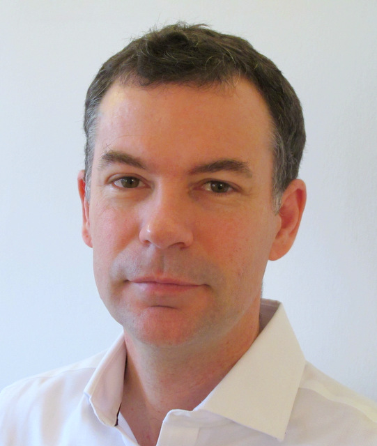

Patrick Janssen is an Associate Professor at the Department of Architecture at the National University of Singapore and is the Director of the Design Automation Laboratory. He is also Adjunct Associate Professor in Automation in Urban Planning and Design at the 3D GeoInformation research group at the Department of Urbanism, Faculty of Architecture and the Built Environment, TU Delft. 

He received his PhD from Hong Kong Polytechnic University, his MSc in Cognitive Science and Intelligent Computing from Westminster University, and his AA Diploma from the Architectural Association.

Patrick conducts research into computational methods and tools for design exploration and optimisation at the building and urban scale.

## Research Focus Areas

A new generation of methods and tools is required that integrates designers, data, and most importantly, citizens. Being accessible to a much broader range of stakeholders is crucial for such future methods and tools. Taking this as the starting point, Patrick's research focuses on three key approaches:

**Data Visualization:** The number of open urban datasets, accessible through various websites, portals, and programming interfaces (APIs), is multiplying rapidly. Stakeholders need to be able to interrogate such datasets to discover hidden urban interactions and to draw attention to specific issues or questions. The research develops web-based visualization methods that allow diverse 3D geospatial datasets to be published as dynamic interactive models that stakeholders can access. 

**Parametric Modelling:** Visual programming languages are currently used in a variety of modelling domains, including Parametric Modelling, Building Information Modelling, City Information Modelling, and Geographic Information Systems. Stakeholders can use such visual programming languages to create geo-computational procedures for generating and evaluating urban information models. The research is developing new web-based visual programming methods to make it easier for non-experts to write geo-computational procedures.

**Design Optimization:** Increasing urban density around the world has both positive and negative impacts on human well-being. Stakeholders need to be able to explore alternative scenarios for urban densification taking into account possible social, environmental, and economic changes - while maximising human well-being. The research is developing web-based optimisation algorithms that allow urban densification scenarios to be explored in a semi-automated way. 
